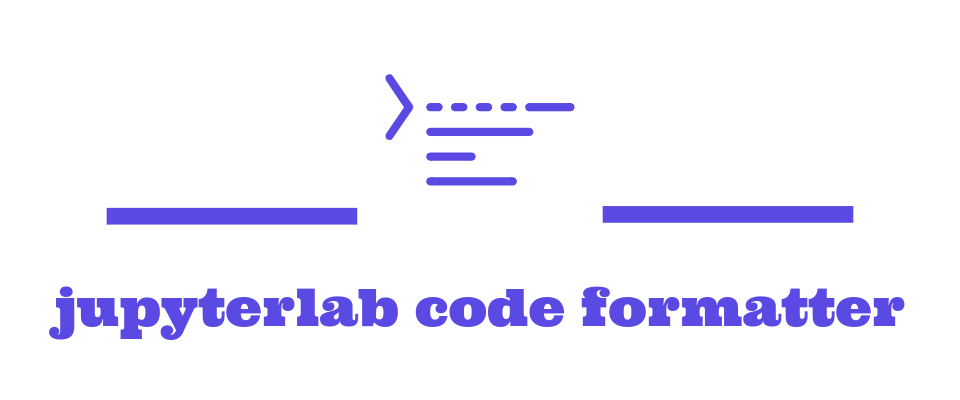

_A JupyterLab plugin to facilitate invocation of code formatters._

---

Documentation: [Hosted on ReadTheDocs](https://jupyterlab-code-formatter.readthedocs.io/)

---

## Demo


---

## Quick Start

I recommend you going to the [documentation site](https://jupyterlab-code-formatter.readthedocs.io/#quick-start), but this should work too.

1. **Install the package**

```bash
pip install jupyterlab-code-formatter
```

2. **Install some supported formatters** (isort+black are default for Python)

```bash
# NOTE: Install black and isort,
#       JL code formatter is configured to invoke isort and black by default
pip install black isort
```

3. **Restart JupyterLab**

This plugin includes a server plugin, restart JupyterLab if you have followed the above steps while it's running.

4. **Configure plugin**

To configure which/how formatters are invoked, see [configuration](https://jupyterlab-code-formatter.readthedocs.io/configuration.html).

---

## Getting help

If you don't use Discord then feel free to open a [GitHub issue](https://github.com/jupyterlab-contrib/jupyterlab_code_formatter/issues), do note I am a bit slower in responding in GitHub.

---

## Your Support

I could really use your support in giving me a star on GitHub, recommending features or fixing bugs.

- [Recommending features via GitHub Issues](https://github.com/ryantam626/jupyterlab_code_formatter/issues)
- [Submitting your PR on GitHub](https://github.com/ryantam626/jupyterlab_code_formatter/pulls)

---

## Contributors

This extension was originally developed and maintained by [@ryantam626](https://github.com/ryantam626).
Massive thanks to the below list of people who made past contributions to the project!

<a href="https://github.com/ryantam626/jupyterlab_code_formatter/graphs/contributors">
  
</a>

## License

This project is licensed under the terms of the [MIT LICENSE](LICENSE) .
