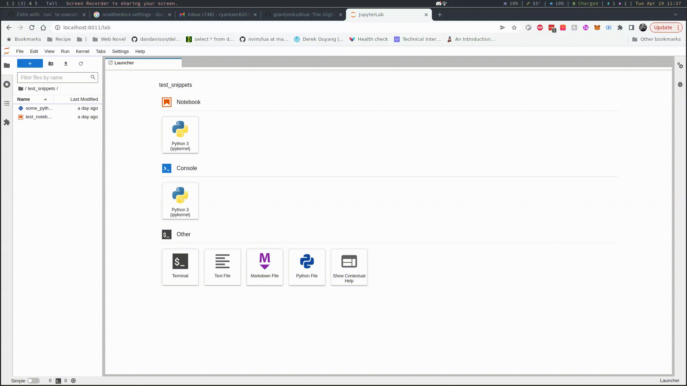

# Configuration

For configuring this plugin, I highly recommend you turn use the JSON Settings Editor instead of the weird graphical settings editor.



## Format On Save

In the settings page, include the following key value pair:-

```json
{
  "formatOnSave": true
}
```

:::{note}
Settings can be found in "Settings" in the toolbar > "Advanced Settings Editor" > "Jupyterlab Code Formatter".
:::

This invokes `jupyterlab_code_formatter:format_all` every time you save, which uses the [default formatters specified in settings](#changing-default-formatters).

## Keyboard Shortcuts

To add a keyboard shortcut calling the JupyterLab commands registered by this plugin (documented [here](usage.md#preface)), add an entry in the Advanced Setting Edtior of JupyterLab (TDOO: How to get there.) like so:-

```json
{
  "shortcuts": [
    {
      "command": "jupyterlab_code_formatter:format",
      "keys": ["Ctrl K", "Ctrl M"],
      "selector": ".jp-Notebook.jp-mod-editMode"
    }
  ]
}
```

The above example breaks down to

- Under edit mode (detected through the selector);
- Using the chord `Ctrl+K Ctrl+M`;
- Invoke the `jupyterlab_code_formatter:format` command;

## Changing Default Formatter(s)

The `jupyterlab_code_formatter:format` and `jupyterlab_code_formatter:format_all` JupyterLab commands will always invoke the formatter(s) specified in the settings.

:::{note}
Settings can be found in "Settings" in the toolbar > "Advanced Settings Editor" > "Jupyterlab Code Formatter".
:::

To override the default settings, enter something like so in the "User Preferences" panel of the settings:-

```json
{
  "preferences": {
    "default_formatter": {
      "python": "autopep8",
      "R": "styler"
    }
  }
}
```

## Changing Formatter Parameters

Sometimes the stock default config of a code formatter doesn't suit your need, you can override the code formatter in the settings.

:::{note}
Settings can be found in "Settings" in the toolbar > "Advanced Settings Editor" > "Jupyterlab Code Formatter".
:::

For example to override settings for the `autopep8` formatter, enter something like so in the "User Preferences" pnael of the settings:-

```json
{
  "autopep8": {
    "max_line_length": 120,
    "ignore": ["E226", "E302", "E41"]
  }
}
```

:::{warning}
This plugin does not pick up file based configuration at the moment (e.g. setup.cfg, pyproject.yml, etc.)

Ticket is already opened at [#167](https://github.com/jupyterlab-contrib/jupyterlab_code_formatter/issues/167).
:::

:::{warning}
This plugin might be out of sync with the list of possibilities of configuration option.

See [settings.json](https://github.com/jupyterlab-contrib/jupyterlab_code_formatter/blob/master/schema/settings.json) for the JSON schema used, feel free to open a PR for updating it.
:::

## Chaining Formatters Invocation

The `jupyterlab_code_formatter:format` and `jupyterlab_code_formatter:format_all` JupyterLab commands support invocation of multiple formatters one after the other via settings.

:::{note}
Settings can be found in "Settings" in the toolbar > "Advanced Settings Editor" > "Jupyterlab Code Formatter".
:::

To do so, configure the default formatter to be an array of strings:-

```json
{
  "preferences": {
    "default_formatter": {
      "python": ["isort", "black"],
      "R": ["styler", "formatR"]
    }
  }
}
```

## R Formatter Configuration Example

R formatters are a little finicky to configure, the `list` construct in R is actually a JSON dictionary, to configure value of `math_token_spacing` and `reindention` of `styler`, do something like so:-

```json
{
  "styler": {
    "math_token_spacing": {
      "zero": ["'^'"],
      "one": ["'+'", "'-'", "'*'", "'/'"]
    },
    "reindention": {
      "regex_pattern": "^###",
      "indention": 0,
      "comments_only": true
    }
  }
}
```

Once again this is done in the settings page.

:::{note}
Settings can be found in "Settings" in the toolbar > "Advanced Settings Editor" > "Jupyterlab Code Formatter".
:::
