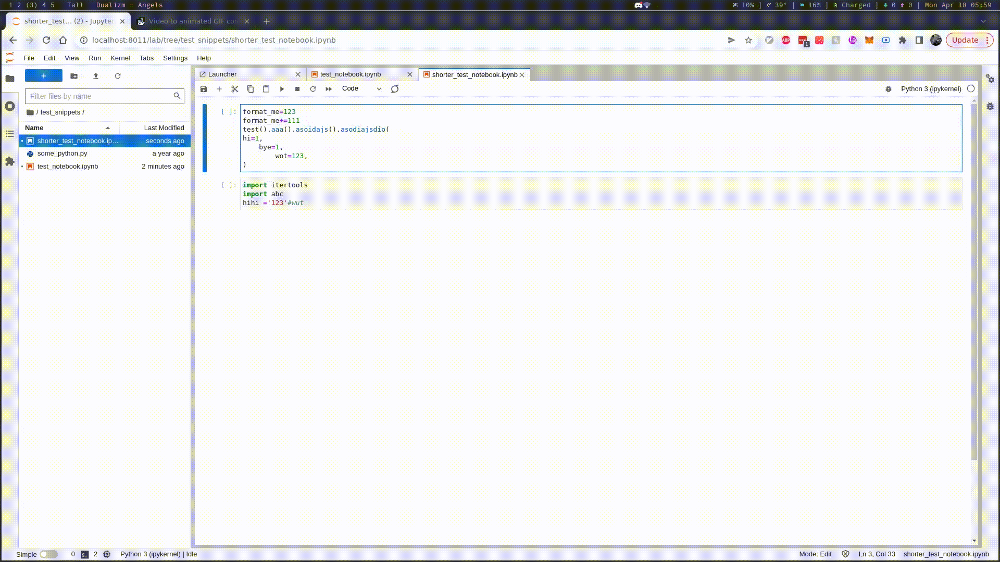

```{toctree}
:hidden:

installation.md
usage.md
configuration.md
custom-formatter.md
faq.md
jupyterhub.md
changelog.md
dev.md
getting-help.md
your-support.md

```

# JupyterLab Code Formatter

_A JupyterLab plugin to facilitate invocation of code formatters._

**Source Code**: [GitHub](https://github.com/jupyterlab-contrib/jupyterlab_code_formatter/).

## Demo



## Requirements

- Python 3.7+
- JupyterLab >= 3.6.0 (if you are using JupyterLab>=3.0,<=3.5, pin this package to 2.0.0)
- Any supported code formatters (you can also specify your own, see [custom formatter](custom-formatter.md)).

:::{important}
JupyterLab Code Formatter only provides an interface for invoking code formatters on Jupyter Server, and does not include any code formatter by default.
:::

## Quick Start

[//]: # 'TODO: Add tab for common package managers'

1. **Install the package**

````{tab} Pip
```bash
pip install jupyterlab-code-formatter
```
````

````{tab} Poetry
```bash
poetry add jupyterlab-code-formatter
```
````

````{tab} Pipenv
```bash
pipenv install jupyterlab-code-formatter
```
````

2. **Install some supported formatters** (isort+black are default for Python)

````{tab} Pip
```bash
# NOTE: Install black and isort,
#       JL code formatter is configured to invoke isort and black by default
pip install black isort
```
````

````{tab} Poetry
```bash
# NOTE: Install black and isort,
#       JL code formatter is configured to invoke isort and black by default
poetry add black isort
```
````

````{tab} Pipenv
```bash
# NOTE: Install black and isort,
#       JL code formatter is configured to invoke isort and black by default
pipenv install black isort
```
````

3. **Restart JupyterLab**

This plugin includes a server plugin, as such you will need to restart JupyterLab if you have followed
the above steps while it's running.

4. **Configure plugin**

To configure which/how formatters are invoked, see [configuration](configuration.md).
