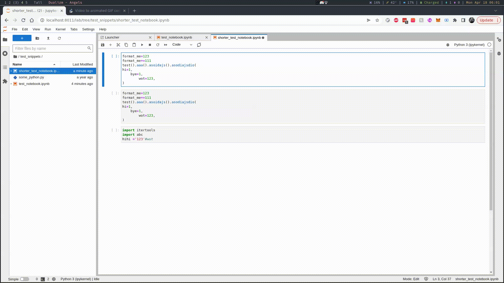
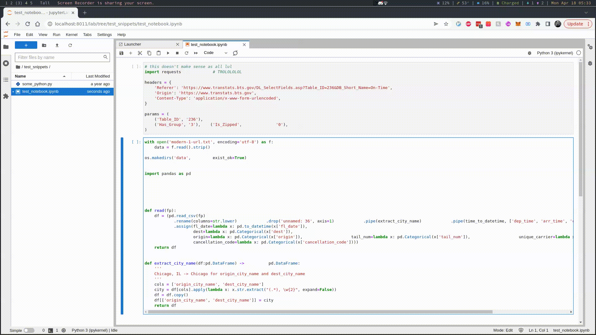

# Usage

## Preface

This plugin registers JupyterLab commands when supported formatters are detected.

Here is a non-exhaustive list of possibilities:

- `jupyterlab_code_formatter:black`
- `jupyterlab_code_formatter:isort`
- `jupyterlab_code_formatter:yapf`
- `jupyterlab_code_formatter:formatr`
- `jupyterlab_code_formatter:styler`

These commands invoke the specified code formatter in the current focused cell.

To find out what formatters are available, you can query http://localhost:8888/jupyterlab_code_formatter/formatters (you might need to replace the port and address), the keys of formatter are shown there.

---

In addition to the above commands, this plugin also adds two non-formatter-specific commands:

- `jupyterlab_code_formatter:format`
- `jupyterlab_code_formatter:format_all`

These commands invoke the configured default code formatters, to configure the default code formatters see [here](configuration.md#changing-default-formatters).

## Invoke Default Code Formatter(s)

Here are some examples showing how to invoke the default code formatter(s) via comand palette.

### For Focused Cell(s)

Example using the context menu:

You can also achieve this by invoking `jupyterlab_code_formatter:format`.

### For The Entire Document

Example using the button on the toolbar:

You can also achieve this by invoking `jupyterlab_code_formatter:format_all`.

## Invoke Specific Code Formatter

Example using the command palette or menu bar:

You can also achieve this by invoking `jupyterlab_code_formatter:black` for example, see possiblities in the [preface](#preface).
